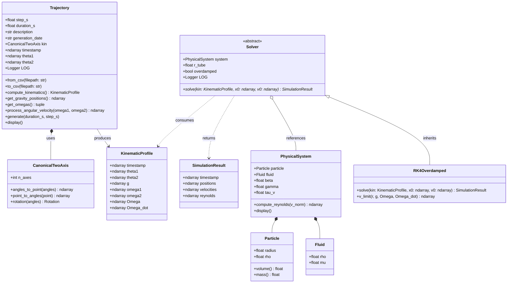

# PRISMA Architecture Specification

This document defines the software architecture, data contracts, and pipeline execution for simulating microscale particle motion inside a Random Positioning Machine (RPM).

---

## 1. Structural Overview

The package enforces a strict one-way dependency model organized around 3 modules: 

```text
src/core/ (conventions, kinematics, physical models)
    ▲
    │
src/trajectory/ (motor angle profiles, CSV parsing, KinematicProfile generation)
    ▲
    │
src/solver/ (RK4 integration, physical regimes, boundary enforcement)
```

- `core` provides foundational invariants (frames, kinematic transformations, physics abstractions). It has zero internal dependencies.
- `trajectory` consumes kinematic mappings from `core` to convert experimental or synthetic motor profiles into vectorized kinematic representations.
- `solver` couples a `PhysicalSystem` with a `KinematicProfile` to numerically integrate the trajectory and generate output data containers.

---

## 2. Directory tree 

Below is the physical layout of the `src/` directory. Each subpackage adheres to single-responsibility principles, hosting distinct domains of the simulation pipeline:

```text 
src/
├── core/
│   ├── conventions.py       # Reference frames (R0, R1, R2), gravity constants, sensor mounts
│   ├── kinematics.py        # Canonical 2-axis kinematics engine, rotation mappings, singularities
│   └── physics.py           # Particle, Fluid, PhysicalSystem, KinematicProfile, SimulationResult
├── solver/
│   ├── __init__.py
│   └── solver.py        # Solver base class and RK4Overdamped implementation
├── trajectory/
│   ├── __init__.py
│   └── Trajectory.py        # CSV import/export, profile generation, kinematic pipeline
└── utils.py                 # File header extraction and metadata parsers
```
An extensive test harness mirrored under `tests/` ensures bidirectional validation between kinematics and physics, enforcing contract consistency across all modules.

---

## 3. Data Contracts

Inter-module communication relies on lightweight, immutable data containers (Python `dataclasses`). This approach standardizes memory layouts, prevents unintended side effects during time-stepping loops, and simplifies unit-testing by clearly delineating expected inputs from computed results.

### 3.1 KinematicProfile (`src/core/physics.py`)

This structure encapsulates the complete time-history of the machine's state. It provides pre-computed spatial and rotational vectors projected into the moving frame $\mathcal{R}_2$, offloading coordinate transformations from the solver's inner integration loop.

Standard immutable/dataclass container passed to numerical solvers:
- `timestamp` : `np.ndarray` — Continuous time vector $t \in \mathbb{R}^N$ (in seconds).
- `theta1`, `theta2`: `np.ndarray` — Inner axis (azimuth) and outer axis (tilt) motor positions ($N$, in radians).
- `omega1`, `omega2`: `np.ndarray` — Angular velocities $\dot{\theta}_1, \dot{\theta}_2$ ($N$, in $\text{rad/s}$).
- `g` : `np.ndarray` — Vectorized apparent gravity trajectory in sample frame $\mathcal{R}_2$ ($(N, 3)$, in $\text{m/s}^2$).
- `Omega` : `np.ndarray` — Angular velocity vector $\vec{\Omega}_{\mathcal{R}_2}$ ($(3, N)$, in $\text{rad/s}$).
- `Omega_dot` : `np.ndarray` — Angular acceleration vector $\dot{\vec{\Omega}}_{\mathcal{R}_2}$ ($(3, N)$, in $\text{rad/s}^2$).

### 3.2 SimulationResult `(src/core/physics.py)`

Produced upon completion of the numerical integration, this container packages the full dynamical history of the particle along with dimensionless validation metrics, providing a single payload for downstream analysis and 3D visualization.

Container holding resolved trajectory dynamics:
- `timestamp` : `np.ndarray` — Time base ($(N,)$).
- `positions` : `np.ndarray` — Cartesian coordinates $\vec{r}(t)$ in sample frame $\mathcal{R}_2$ ($(N, 3)$, in meters).
- `velocities` : `np.ndarray` — Particle velocity vectors $\vec{v}(t)$ ($(N, 3)$, in $\text{m/s}$).
- `reynolds` : `np.ndarray` — Particle Reynolds number history $Re_p(t)$ ($(N,)$).

---

## 4. Pipeline Execution Flow 

The standard execution pipeline transforms raw experimental or synthetic angular profiles into high-fidelity trajectories through three sequential stages:
- **Ingestion & Kinematics Parsing**: Trajectory coordinates are parsed, validated, and converted into continuous kinematic profiles via the canonical two-axis mapping engine.
- **Dynamical Solving**: The numerical solver computes instantaneous limit velocities and advances the particle's spatial coordinates using a 4th-order Runge-Kutta scheme, enforcing boundary constraints at each evaluation step.
- **Validation & Output:** Trajectory derivatives are computed post-integration to evaluate particle Reynolds numbers ($Re_p$), verifying that the creeping flow assumption holds throughout the simulation before serializing results.

```text
CSV Trajectory File [timestamp, theta1, theta2]
                │
                ▼ (Trajectory.from_csv)
    Trajectory.compute_kinematics()
                │
                ▼
         KinematicProfile
                │
                ├───► RK4Overdamped.solve(system, kin, x0, v0)
                │         ├── Local evaluation of v_limit(r, g, w, dw)
                │         ├── 4th-order Runge-Kutta step
                │         ├── Geometric boundary check & projection
                │         └── Instantaneous Re_p computation
                ▼
         SimulationResult
                │
                ▼
  3D Trajectory Visualization / Residual Acceleration Metrics
```

---

## 5. Class diagram 

The following class diagram illustrates the object-oriented structure of the framework, highlighting the relationship between the kinematics backend, the physical system configuration, and the polymorphic solver hierarchy:

