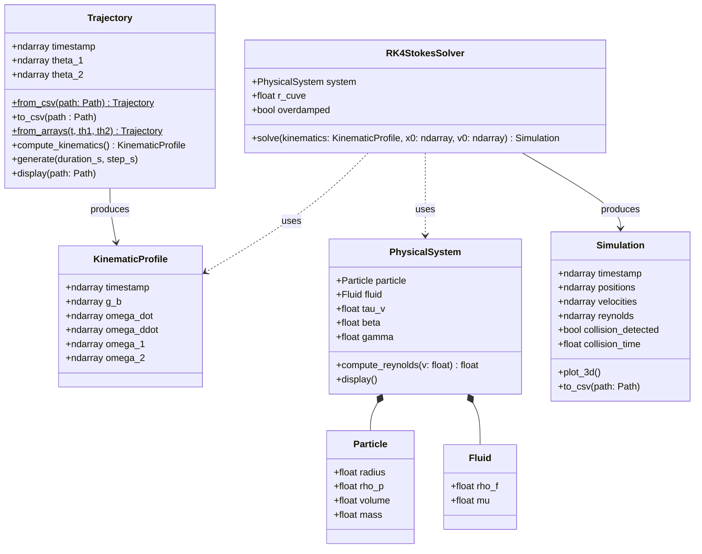

# PRISMA Architecture 

> This file details all the PRISMA tool architecture. 

## 1. Introduction 

At first, `PRISMA` is separated into 3 modules : 
- `core` defines all the essentials constants and referential frames to modelize and simulate a Random Positonning Machine. 
- `trajectory` implements RPM motors trajectory generation and CSV exports. 
- `solver`: a tool box to simulate the RPM trajectory and process the particle motion in the fluid. 

## 2. Class diagram

We present below a class diagram which represents the structure of the different modules and their interactions. 

